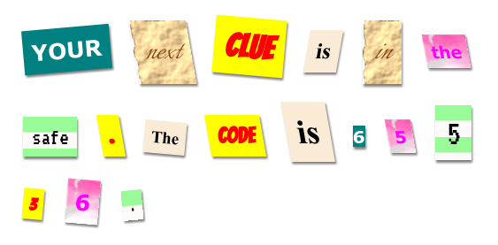

## Introduction

In this project, you'll create a mystery letter that looks like each word has been cut from a different newspaper, magazine, comic or other source. 

### Additional information for club leaders

If you need to print this project, please use the [Printer friendly version](https://projects.raspberrypi.org/en/projects/mystery-letter/print).

--- collapse ---
---
title: Club leader notes
---

## Introduction:
In this project, children are introduced to CSS classes. They use multiple CSS classes to style text and also learn how to use background images and free Google fonts in their projects. 

## Online Resources

We recommend using [trinket](https://trinket.io/) to write HTML & CSS online. This project contains the following trinket:

+ ['Mystery Letter' starting point  -- jumpto.cc/web-letter](http://jumpto.cc/web-letter)

Children can also make use of this blank trinket [(jumpto.cc/html-blank)](http://jumpto.cc/html-blank) to write their own HTML & CSS, or alternatively they can use this template trinket [(jumpto.cc/html-template)](http://jumpto.cc/html-template).

There is also a trinket containing a sample solution to the challenges:

+ ['Mystery Letter Finished' -- trinket.io/html/1d4d4c5ce1](https://trinket.io/html/1d4d4c5ce1)

## Offline Resources
This project can be [completed offline](https://www.codeclubprojects.org/en-GB/resources/webdev-working-offline/) if preferred. You can access the project resources by clicking the 'Project Materials' link for this project. This link contains a 'Project Resources' section, which includes resources that children will need to complete this project offline. Make sure that each child has access to a copy of these resources. This section includes the following files:

+ mystery-letter/index.html
+ mystery-letter/style.css
+ mystery-letter/script.js
+ mystery-letter/prefixfree.js
+ mystery-letter/4 x .png images
+ template/template.html
+ template/style.css

You can also find a completed version of this project's challenges in the 'Volunteer Resources' section, which contains:

+ mystery-letter-finished/index.html
+ mystery-letter-finished/style.css
+ mystery-letter-finished/script.js
+ mystery-letter-finished/prefixfree.js
+ mystery-letter-finished/4 x .png images

(All of the resources above are also downloadable as project and volunteer `.zip` files.)

## Learning Objectives
+ This project introduces CSS classes and the ability to style HTML elements with multiple classes.
+ Background images and Google fonts are also introduced. 

This project covers elements from the following strands of the [Raspberry Pi Digital Making Curriculum](http://rpf.io/curriculum):

+ [Design basic 2D and 3D assets](https://www.raspberrypi.org/curriculum/design/creator)
+ Understand the skills which are developed towards a career involving Computing

## Challenges
+ “Style your message” - Apply provided CSS class styles;
+ “Create a computer printout style” - Use CSS to recreate an example class using a background image and Google font. 
+ “Create your own styles” - Use CSS to create new styles.

--- /collapse ---

--- collapse ---
---
title: Project materials
---
## Project resources
* [.zip file containing all project resources](resources/letter-project-resources.zip)
* [Online Trinket containing all 'Mystery Letter' project resources](http://jumpto.cc/web-letter)
* [Online Trinket template](http://jumpto.cc/trinket-template)
* [Online blank Trinket](http://jumpto.cc/trinket-blank)
* [template/index.html](resources/template-index.html)
* [template/style.css](resources/template-style.css)
* [mystery-letter/index.html](resources/mystery-letter-index.html)
* [mystery-letter/style.css](resources/mystery-letter-style.css)
* [mystery-letter/prefixfree.js](resources/mystery-letter-prefixfree.js)
* [mystery-letter/rough-paper.png](resources/mystery-letter-rough-paper.png)
* [mystery-letter/canvas.png](resources/mystery-letter-canvas.png)
* [mystery-letter/pink-pattern.png](resources/mystery-letter-pink-pattern.png)
* [mystery-letter/computer-printout-paper.png](resources/mystery-letter-computer-printout-paper.png)

## Club leader resources
* [.zip file containing all completed project resources](resources/letter-volunteer-resources.zip)
* [Online completed Trinket project](https://trinket.io/html/1d4d4c5ce1)
* [mystery-letter-finished/index.html](resources/mystery-letter-finished-index.html)
* [mystery-letter-finished/style.css](resources/mystery-letter-finished-style.css)
* [mystery-letter-finished/prefixfree.js](resources/mystery-letter-finished-prefixfree.js)
* [mystery-letter-finished/rough-paper.png](resources/mystery-letter-finished-rough-paper.png)
* [mystery-letter-finished/canvas.png](resources/mystery-letter-finished-canvas.png)
* [mystery-letter-finished/pink-pattern.png](resources/mystery-letter-finished-pink-pattern.png)
* [mystery-letter-finished/computer-printout-paper.png](resources/mystery-letter-finished-computer-printout-paper.png)

--- /collapse ---
