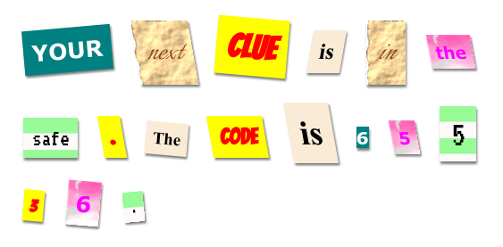

--- challenge ---
## Challenge: Create Your Own Styles

Now create your own class styles and make your mystery letter even more interesting. Use the CSS that you have learnt in previous projects and look at the examples in __style.css__ for ideas. 

Here's an example:

You can see the images that are available to use by clicking on the Images tab in trinket.
Try setting image backgrounds using one of the included images: 

+ `rough-paper.png`

+ `canvas.png`

If you have a trinket account, you can upload images of your own as you did in the 'Tell a Story' Project. 

Find fonts that you like on <a href="http://jumpto.cc/web-fonts" target="_blank">jumpto.cc/web-fonts</a> and copy their `<link>` and CSS code into your trinket to use them. 

--- /challenge ---